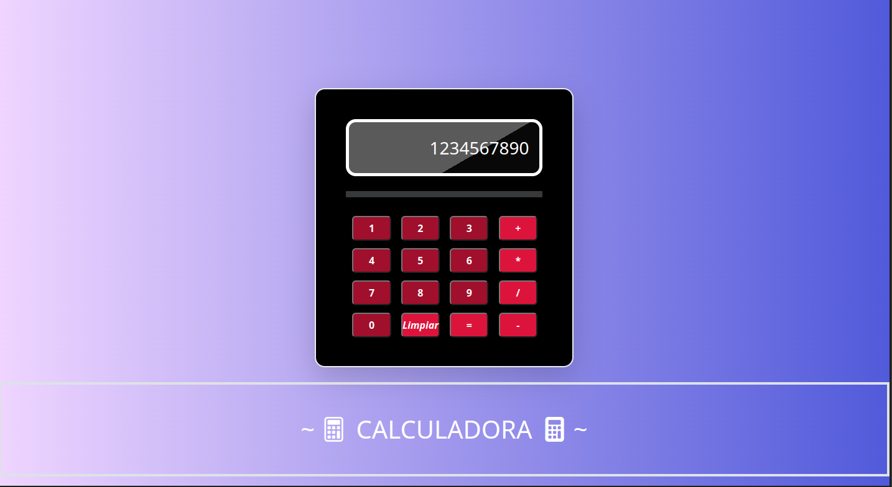

# Proyecto Calculadora

En este proyecto realicé una calculadora; iniciando la estructura en el HTML, utilizando bootstrap y sus diferentes clases para el diseño de la misma ; creando clases en CSS y dándole forma a la calculadora, luego procedí a crear el código en JS para hacerla dinámica e interactiva.

